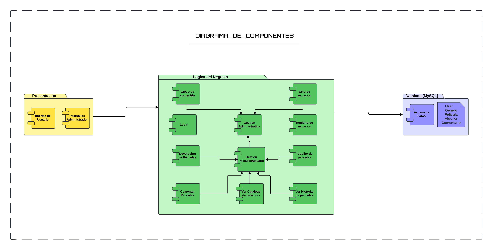

# *PeliFlix*
## Tipo de Manual:
Técnico
## Versión del sistema: 
V 1.0
## Fecha de Elaboración: 
Junio 2024
## Desarrollado por: 
Grupo 1, Analisis y diseño de sistemas 1, Departamento de Informática, Ingeniería en Ciencias y Sistemas, Universidad de San Carlos de Guatemala.
> -  **Mariano Francisco Camposeco Camposeco - 202030987**
> -  **Erick Estuardo Patzan Polanco    - 201602627**
> -  **María Cecilia Cotzajay López - 201602659**
> -  **Joshua Estuardo Franco Equite - 201708845**

## Objetivos del proyecto
### Objetivo General
- ofrecer una plataforma de alquiler de películas en línea eficiente y de alta calidad, proporcionando una experiencia de usuario excepcional y permitiendo una administración efectiva del contenido y de los usuarios.
### Objetivos especificos:
- Implementar un sistema de autenticación y gestión de usuarios robusto.
- Desarrollar un módulo de administración eficiente para la gestión del contenido.
- Diseñar y construir una base de datos optimizada y estructurada.
- Proporcionar una experiencia de usuario fluida y atractiva.
## Descripción del proyecto
PeliFlix es una plataforma de streaming y alquiler de películas en línea, diseñada para ofrecer una experiencia de entretenimiento digital de alta calidad. La plataforma permite a los usuarios alquilar películas, dejar comentarios y gestionar sus perfiles, mientras que los administradores pueden gestionar el contenido y los usuarios.
## Fundamentación de la tecnología utilizada
> - **Frontend:** React
> - **Backend:** Node js con Expresss.js
> - **Servicio de Base de datos:** Clever cloud, DBMS: MySQL

## Funcionalidades Principales

- **Autenticación y Registro de Usuarios**
  - **Registro:** Implementado con validaciones para asegurar que los usuarios proporcionen información completa y correcta. Los datos incluyen nombre, apellido, género (con opciones 'F' o 'M'), correo electrónico (único), contraseña (mínimo 8 caracteres, al menos una mayúscula y números) y fecha de nacimiento.
  - **Inicio de Sesión:** Autenticación segura con manejo de sesiones y mensajes de error en caso de fallos.

- **Módulo Administrador**
  - **Ingreso de Películas:** Formularios para añadir nuevas películas al catálogo, capturando información detallada (título, sinopsis, precio de alquiler, director, año de estreno, duración, imagen y género).
  - **Actualización de Contenido:** Funcionalidad para editar detalles de las películas y corregir errores.
  - **Eliminación de Contenido:** Permite eliminar películas que no cumplen con los estándares de calidad o tienen baja demanda.
  - **Gestión de Usuarios:** Opciones para eliminar usuarios que infringen las normas de la plataforma.

- **Módulo Usuario**
  - **Catálogo de Películas:** Visualización del catálogo con filtros y exclusión de películas ya alquiladas por el usuario. Muestra título, imagen, precio de alquiler, género y duración del alquiler.
  - **Comentarios:** Permite a los usuarios agregar y eliminar sus propios comentarios sobre las películas.
  - **Alquiler de Películas:** Los usuarios pueden alquilar películas por 48 horas, con gestión de multas por retraso (Q5.00 por día).
  - **Historial de Alquiler:** Registro detallado de todos los alquileres realizados por el usuario, incluyendo fechas de devolución y multas.
  - **Editar Perfil:** Funcionalidad para que los usuarios actualicen sus datos personales, exceptuando el correo electrónico.

- **Pruebas Unitarias:** un total de 6 pruebas unitarias.
- **Documentación del Proyecto:** diagrama modelo entidad relacion, diagrama de clases, diagrama de Componentes, diagrama de Despliegue.

## Diagramas de Modelamiento
### Modelo Entidad Relacion (ERD)
El diagrama describe las entidades y sus relaciones dentro del sistema de gestion de alquileres de películas. Este es un diagrama fundamental para la estructura de la base de datos ya que define como se almacenan y conectan las entidades descritas el cual asegura la integridad referencial y facilita la consulta eficiente de los datos.

  

### Diagrama de Clases
El diagrama esta basado en el modelo entidad relacion. Cada clase corresponde a una entidad en el ERD, define sus atributos y métodos. Este diagrama es fundamental para la implementación del sistema, ya que proporciona una estructura clara para la lógica del negocio y la interacción con la base de datos.

  ![documentation/Diagrama_Clases.PNG]documentation/(Diagrama_Clases.PNG)

### Diagama de Componentes
El diagrama esta basado en el diagrama de clases. Muestra la organización y la relación entre los componentes de software del sistema. Este diagrama proporciona una visión clara de la arquitectura del software, facilitando la comprensión de la distribución de responsabilidades y la comunicación entre los diferentes módulos ó componentes del sistema.

  

### Diagrama de Despliegue
El diagrama esta basado en el diagrama de componentes. Proporciona una visión clara de la infraestructura necesaria para ejecutar el sistema, incluyendo detalles sobre la comunicación entre los servidores y la base de datos, asegurando que todos los componentes del sistema estén correctamente conectados y desplegados para ofrecer un rendimiento óptimo.

  

## Metodología Implementada
### SCRUM
Para nuestro proyecto de desarrollo de la plataforma de streaming PeliFlix, utilizamos Scrum para asegurar una entrega eficiente y de alta calidad.
 - **[Sprint Planning](https://drive.google.com/file/d/15F6JhvmYyT0E3lO8O7Jh0mNADRXdMCc1/view?usp=drive_link)**
 En la fase de planificación, definimos los objetivos y las tareas a realizar durante el sprint. PeliFlix, identificamos las características clave que deben implementarse, como el registro de usuarios, la gestión de películas y la funcionalidad de alquiler. Creamos un backlog de producto con todas las historias de usuario y de administrador.
- **[Daily Scrum](https://drive.google.com/file/d/1EpKUgFuwf4OuxTAWqCj_mqRJ-cMylT7n/view?usp=drive_link)**
  Realizamos tres reuniones diarias cortas para sincronizar el progreso del equipo, identificar obstáculos y planificar el trabajo del día.
  - [Daily Scrum 1](https://drive.google.com/file/d/1EpKUgFuwf4OuxTAWqCj_mqRJ-cMylT7n/view?usp=drive_link)
  - [Daily Scrum 2](https://drive.google.com/file/d/1haxRSCAgqOi0bsQFjfeXG0ygeTguBVNy/view?usp=drive_link)
  - [Daily Scrum 3](https://drive.google.com/file/d/1GPVa1k5kmz1Eq01FUa2-IBLKVPoCcUHy/view?usp=drive_link)
 - **[Sprint Retrospective](https://drive.google.com/file/d/1q2Dz4KFAGz5cTrSPe0Xa3zwGqEdlykKk/view?usp=drive_link)**
 Al final del sprint, llevamos a cabo una retrospectiva para evaluar qué salió bien, qué se puede mejorar y cómo podemos implementar esas mejoras en el próximo Proyecto. Esta reflexión nos ayuda a mejorar continuamente nuestros procesos y a entregar un producto mejorado en cada iteración.
 - **[Jira](https://www.atlassian.com/es/software/jira)**, **Tablero Kanban**:
Se utilizó para llevar un control de las tareas que se realizaron a
lo largo del proyecto para que todo el grupo de desarrolladores visualizara el progreso del mismo.